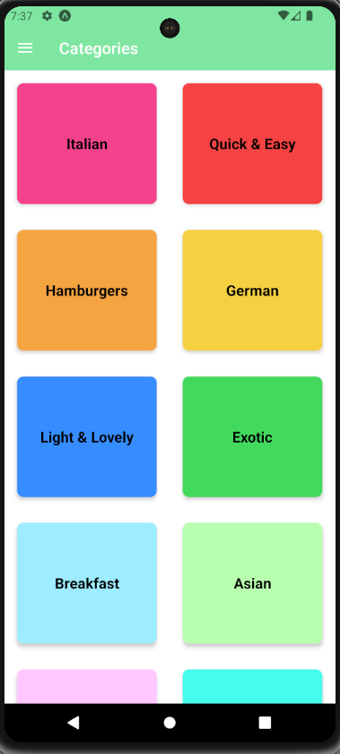
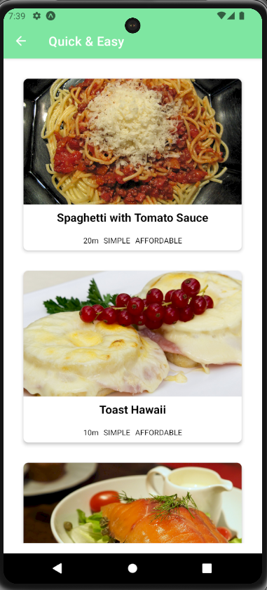

# Meals catalogue - React Native

This is an React native application developed during an Udemy course, to learn some concepts like:

 - React Navigation
 - Stack navigator
 - Drawer navigator
 - Combining navigators

The app is a Restaurant app with some meals categories and details,

## Screenshots

